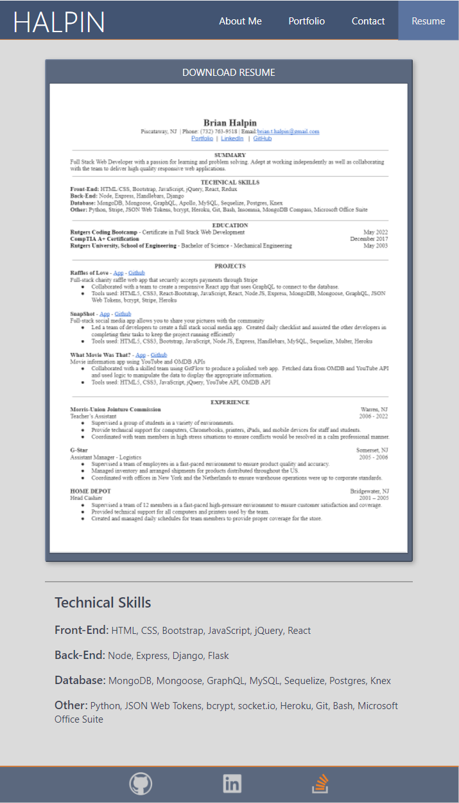

# Portfolio

This is my portfolio for the work that I've done at Rutgers Coding Bootcamp.  The portfolio contains an about me section with a brief summary of who I am,  a project section that contains some of my best projects from the Bootcamp, a contact page to be connected to the backend in the future, and a resume page where you can download my resume.

I hope you enjoy.  Feel free to contact me directly, or check out my GitHub repository, Linkedin, and Stack Overflow pages by clicking the links in the footer.

## Table of Contents

[Links](#links)

[Media](#media)

[Questions](#questions)

## Links
[Portfolio](https://bthalpin.com)

[SnapShot - App](https://snapshot-bh.herokuapp.com/)

[SnapShot - Code](https://github.com/bthalpin/SnapShot)

[What Movie Was That? - App](https://bthalpin.github.io/What-Movie-Was-That/)

[What Movie Was That? - Code](https://github.com/bthalpin/What-Movie-Was-That)

[Weather Forecast - App](https://bthalpin.github.io/Weather-Forecast/)

[Weather Forecast - Code](https://github.com/bthalpin/Weather-Forecast)

[PWA Text Editor - App](https://text-editor-bh.herokuapp.com/)

[PWA Text Editor - Code](https://github.com/bthalpin/text-editor-app)

[Code Quiz - App](https://bthalpin.github.io/Code-Quiz/)

[Code Quiz - Code](https://github.com/bthalpin/Code-Quiz)

[Daily Planner - App](https://bthalpin.github.io/Daily-Planner/)

[Daily Planner - Code](https://github.com/bthalpin/Daily-Planner)
        
## Media
The following image displays home page (About Me section):

This image displays the portfolio page:

This image displays the contact page:

This image displays the resume page:

## Questions
If you have any questions contact me directly at <brian.t.halpin@gmail.com>. You can find more of my work at [Brian Halpin](https://github.com/bthalpin).

